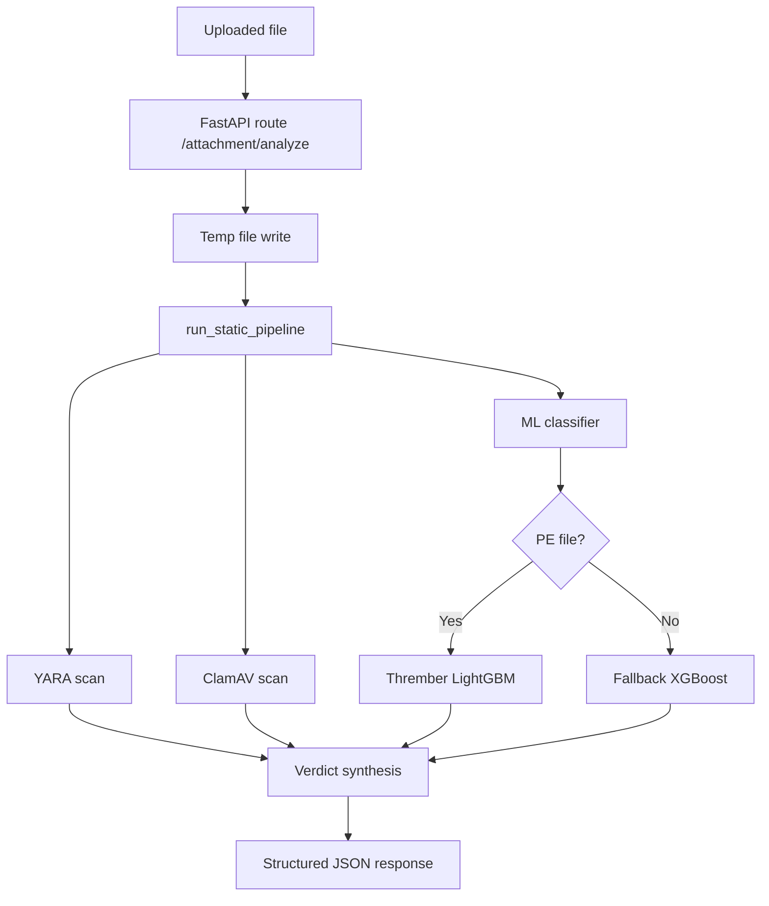

# ZoraAI Attachment Sandbox

Attachment Sandbox is the static file threat-analysis subsystem in ZoraAI. It analyzes uploaded attachments without detonation and returns a structured verdict based on three engines:

1. YARA signatures and heuristics
2. ClamAV signature scanning
3. Machine-learning scoring

The module is integrated into the backend through the route `POST /attachment/analyze` and is designed for low-latency, API-safe analysis of executables and documents.

## Purpose

This project exists to answer one question quickly and consistently for attachments entering ZoraAI:

"Is this file likely malicious, suspicious, or clean based on static evidence?"

It combines deterministic signatures with statistical risk scoring so it can detect:

1. Known malware families (signature hits)
2. Suspicious behavior indicators in binaries/documents (heuristics)
3. Unknown malware patterns (ML anomaly/classification)

## Integration In Main Backend

Attachment Sandbox is consumed by the main FastAPI service via:

1. Router implementation: `app/attachment/router.py`
2. Router registration: `app/main.py`
3. Response schemas: `app/schemas.py`

### API Route

`POST /attachment/analyze`

Request:

1. Content-Type: `multipart/form-data`
2. Field: `file` (uploaded attachment)

Response model: `AttachmentAnalyzeResponse`

1. `filename: str`
2. `file_size: int`
3. `final_verdict: str` (`suspicious` or `clean` from current pipeline)
4. `engines: dict[str, AttachmentEngineResult]`
5. `features: dict[str, Any]`

`AttachmentEngineResult` fields:

1. `is_flagged: bool`
2. `hits: list[str] | None` (YARA)
3. `signature: str | None` (ClamAV)
4. `score: float | None` (ML probability)

## High-Level Architecture



## Part-By-Part Explanation Of What Is Used

This section explains each part used when a file is sent to the attachment analyzer.

### 1) Entry Point In Backend API

The request enters through the main backend router at `POST /attachment/analyze`.

What this API part does:

1. Accepts a multipart upload with the `file` field.
2. Validates that a file exists and is not empty.
3. Writes bytes to a temporary file path.
4. Calls the sandbox pipeline runner.
5. Normalizes engine results into API schema format.
6. Returns structured JSON response.
7. Deletes temporary file in a `finally` block.

Why this is used:

1. The static pipeline operates on file paths.
2. Temporary files prevent storing user uploads permanently by default.
3. Normalization keeps output stable for frontend/consumers.

### 2) Dynamic Sandbox Loader

The attachment router dynamically loads the sandbox pipeline module.

What this loader part does:

1. Adds `app/attachment-sandbox` to `sys.path`.
2. Imports `app.static_analysis.pipeline` at runtime.
3. Pulls `run_static_pipeline` and executes it.

Why this is used:

1. `attachment-sandbox` is a separate folder with its own package structure.
2. Runtime import avoids tight compile-time coupling.
3. Keeps the backend API and sandbox internals modular.

### 3) Pipeline Orchestrator (run_static_pipeline)

This is the central coordinator in `app/static_analysis/pipeline.py`.

What this part does:

1. Runs YARA scan for rules/signatures.
2. Runs ClamAV scan for known malware signatures.
3. Runs ML scoring (Thrember or fallback XGBoost).
4. Applies verdict synthesis logic.
5. Returns report with `final_verdict`, `engines`, and `features`.

Why this is used:

1. Gives one stable function for end-to-end static analysis.
2. Combines deterministic and probabilistic detection methods.
3. Produces a single machine-readable output contract.

### 4) YARA Scanner

YARA is used as a fast pattern/heuristic detector.

What this part does:

1. Compiles the YARA rules file lazily and caches it.
2. Matches rule signatures against file content.
3. Returns rule names that matched.

Why this is used:

1. Excellent for known strings/patterns and lightweight heuristics.
2. Fast first-pass signal before deeper processing.
3. Easy to extend by adding/updating rules.

### 5) ClamAV Scanner

ClamAV is used as an antivirus signature engine.

What this part does:

1. Connects to clamd using host/port env settings.
2. Streams file bytes via socket.
3. Returns whether a malware signature was found and the signature name.

Why this is used:

1. Adds battle-tested AV coverage for known malware families.
2. Complements YARA with a large signature ecosystem.
3. Improves confidence on commodity malware detection.

### 6) MIME Detection And File Routing

Before model scoring, the system determines file type/category.

What this part does:

1. Tries `python-magic` for MIME sniffing.
2. Falls back to extension mapping and mimetypes.
3. Maps MIME to categories like `pe`, `pdf`, `office`, `archive`, `script`, `unknown`.

Why this is used:

1. Different file families need different feature extractors.
2. Enables PE-specific vs document-specific ML logic.
3. Prevents applying the wrong parser/model path.

### 7) Base Feature Extractor

This runs for all files regardless of type.

What this part does:

1. Reads file size.
2. Computes Shannon entropy.
3. Extracts printable strings.
4. Detects heuristic indicators (IP, registry keys, PowerShell, base64 blobs).

Why this is used:

1. Provides universal risk context for any attachment type.
2. Supplies model input features for fallback path.
3. Adds explainable indicators for UI/debugging.

### 8) Type-Specific Parsers

The pipeline enriches features by file category.

PE parser usage:

1. Section entropy and section count.
2. Suspicious section names and APIs.
3. Overlay detection.

PDF parser usage:

1. Page count.
2. JavaScript markers.
3. Embedded file and launch actions.
4. Suspicious URL pattern detection.

Office parser usage:

1. Macro presence detection.
2. Auto-open trigger detection.
3. External link/DDE/obfuscation checks.

Why these are used:

1. File-format-specific behavior provides stronger signal than generic features alone.
2. Supports explainability through concrete indicators.
3. Improves fallback model performance on non-PE documents.

### 9) Thrember LightGBM Model Path (PE Files)

For PE files, the classifier first attempts Thrember.

What this part does:

1. Uses `PEFeatureExtractor` in `thrember/features.py`.
2. Builds high-dimensional PE vectors.
3. Scores with `EMBER2024_PE.model` via LightGBM.

Why this is used:

1. PE malware needs richer structural features.
2. Thrember path is specialized for executable detection.
3. Usually provides stronger PE discrimination than generic fallback.

### 10) Fallback XGBoost Model Path

For non-PE files, or if Thrember path fails, fallback model is used.

What this part does:

1. Builds ordered vector from the 23 fixed `FEATURE_COLS`.
2. Loads `models/static_classifier.pkl`.
3. Produces malicious probability score.

Why this is used:

1. Keeps analysis available even if PE-specific path is not applicable.
2. Supports document-centric signals (PDF/Office).
3. Ensures graceful degradation when Thrember is unavailable.

### 11) Verdict Synthesizer

Final result merges engine outcomes.

What this part does:

1. Flags ML if score >= 0.75.
2. Flags YARA if at least one hit.
3. Flags ClamAV if signature found.
4. Marks final verdict suspicious if any engine flags.

Why this is used:

1. Conservative policy reduces false negatives.
2. Easy to reason about and debug.
3. Keeps behavior deterministic and transparent.

### 12) Training And Dataset Components

Training modules are used to build/update fallback model artifacts.

What this part does:

1. `prepare_dataset.py` maps EMBER vectors into fallback feature schema.
2. `train_static_classifier.py` trains/evaluates/saves XGBoost model.
3. `evaluate_model.py` benchmarks model over arbitrary directories.

Why this is used:

1. Keeps model reproducible and maintainable.
2. Allows periodic retraining as threat distributions shift.
3. Separates runtime inference from offline training lifecycle.

### 13) Rule And Model Artifacts

These files are the runtime intelligence assets.

What this part uses:

1. `models/yara_rules.yar` for rule matching.
2. `models/EMBER2024_PE.model` for PE LightGBM scoring.
3. `models/static_classifier.pkl` for fallback XGBoost scoring.

Why these are used:

1. Decouples logic from intelligence data.
2. Enables updates without large code changes.
3. Supports versioning and future model rotation.

### 14) Schemas Used By API Response

The backend response contracts are defined in the central schema file.

What this part does:

1. `AttachmentEngineResult` shapes per-engine outputs.
2. `AttachmentAnalyzeResponse` shapes final API payload.

Why this is used:

1. Strongly typed response consistency.
2. Safer frontend integration.
3. Easier documentation and testing.

## Verdict Logic (Current)

In `app/static_analysis/pipeline.py`, `final_verdict` is currently synthesized as:

1. `ml_flag = ml_score >= 0.75`
2. `yara_flag = len(yara_hits) > 0`
3. `clam_flag = clamav_is_malicious`
4. `is_suspicious = ml_flag or yara_flag or clam_flag`

This is intentionally strict. Any YARA hit can mark the final verdict suspicious.

## Directory Map And File Responsibilities

### Root

`app/attachment-sandbox/`

1. `README.md`: this documentation
2. `app/`: static analysis and training packages
3. `data/`: datasets and processed features
4. `models/`: model artifacts and YARA rules
5. `tests/`: smoke/e2e scripts
6. `thrember/`: high-dimensional PE feature extraction + LightGBM utilities

### Static Analysis Package

`app/attachment-sandbox/app/static_analysis/`

1. `pipeline.py`
Purpose: orchestrates YARA -> ClamAV -> ML and returns unified report

2. `yara_scanner.py`
Purpose: lazily compiles rules (`_YARA_RULES` cache) and returns matched rule names

3. `clamav_scanner.py`
Purpose: scans via `clamd.ClamdNetworkSocket` using env host/port and returns `(is_malicious, signature)`

4. `classifier.py`
Purpose: feature extraction and ML scoring hub
Behavior:
1. Extract base and type-specific features
2. Use Thrember model for PE files when available
3. Fallback to XGBoost model when Thrember unavailable/fails or file is non-PE

5. `extractor.py`
Purpose: file-agnostic static features
Features include size, entropy, string count, IP/registry/powershell/base64 indicators

6. `mime_detector.py`
Purpose: detect MIME by `python-magic` with extension fallback and map to categories
Categories: `pe`, `pdf`, `office`, `archive`, `script`, `unknown`

7. `pe_parser.py`
Purpose: PE-specific features (sections, imports, suspicious APIs, overlays)

8. `pdf_parser.py`
Purpose: PDF-specific features (JS, embedded files, launch actions, suspicious URLs)

9. `office_parser.py`
Purpose: Office macro and VBA abuse indicators (auto-open, links, DDE, obfuscation)

10. `__init__.py`
Purpose: exports `predict` and `FEATURE_COLS`

### Training Package

`app/attachment-sandbox/app/training/`

1. `prepare_dataset.py`
Purpose: maps EMBER parquet vectors into the 23-feature schema used by fallback XGBoost
Key notes:
1. Vectorized pandas/numpy processing
2. Reads `.parquet` batches with `pyarrow.parquet.ParquetFile`
3. Outputs processed parquet with mapped features + label

2. `train_static_classifier.py`
Purpose: trains fallback XGBoost classifier and saves `static_classifier.pkl`
Key steps:
1. Load cached processed data or build from EMBER
2. Stratified train/val/test split
3. Train with early stopping
4. Evaluate ROC-AUC, FPR/FNR, confusion matrix
5. Save model and run end-to-end predict() verification

3. `evaluate_model.py`
Purpose: evaluate saved model over a local directory of files
Outputs summary and top risk-scored files

4. `__init__.py`
Purpose: package marker

### Thrember Package

`app/attachment-sandbox/thrember/`

1. `features.py`
Purpose: high-dimensional PE feature system
Core classes:
1. `GeneralFileInfo`
2. `ByteHistogram`
3. `ByteEntropyHistogram`
4. `StringExtractor`
5. `HeaderFileInfo`
6. `SectionInfo`
7. `ImportsInfo`
8. `ExportsInfo`
9. `DataDirectories`
10. `RichHeader`
11. `AuthenticodeSignature`
12. `PEFormatWarnings`
13. `PEFeatureExtractor`

2. `model.py`
Purpose: vectorization/training/prediction utilities for EMBER2024-style workflows
Includes:
1. dataset file discovery and iterators
2. feature vectorization to memory-mapped arrays
3. LightGBM training and optimization helpers
4. `predict_sample()` for single PE byte stream

3. `download.py`
Purpose: download EMBER2024 dataset/model artifacts from Hugging Face repos

4. `pefile_warnings.txt`
Purpose: canonical warning patterns used by `PEFormatWarnings`

5. `__init__.py`
Purpose: exports feature/model/download APIs

### Models And Rules

`app/attachment-sandbox/models/`

1. `EMBER2024_PE.model`
Purpose: LightGBM model for PE scoring in Thrember path

2. `static_classifier.pkl`
Purpose: fallback XGBoost model for non-PE or Thrember fallback path

3. `yara_rules.yar`
Purpose: static signature/heuristic rulepack
Current rule set:
1. `Suspicious_Powershell_Download`
2. `Suspicious_Base64_Executable`
3. `Embedded_IP_Address_Pattern`
4. `Generic_Ransomware_Notes`
5. `Suspicious_API_Usage`
6. `Suspicious_Macro_AutoStart`
7. `EICAR_Test_File`

### Data Folder

`app/attachment-sandbox/data/`

1. `emberdataset/`: raw EMBER parquet files expected by training prep
2. `processed/`: processed parquet outputs used by fallback model training

### Tests

`app/attachment-sandbox/tests/`

1. `test_pipeline.py`
Purpose: end-to-end smoke script running the full 3-stage pipeline

2. `static_predictor.py`
Purpose: direct classifier inference script for a local sample

3. `python-3.12.5-amd64.exe`
Purpose: local benign sample often used for sanity checks/false-positive testing

## ML Feature Schema Used By Fallback XGBoost

`FEATURE_COLS` in `classifier.py` currently defines 23 features grouped as:

1. Base file features
2. PE parser features
3. PDF parser features
4. Office parser features

The feature order is fixed and must remain stable for model compatibility.

## Environment Variables

Supported environment variables across module:

1. `YARA_RULES_PATH`
Purpose: override YARA rules file path

2. `CLAMAV_HOST`
Purpose: ClamAV host (default `localhost`)

3. `CLAMAV_PORT`
Purpose: ClamAV port (default `3310`)

4. `STATIC_THREMBER_MODEL_PATH`
Purpose: override path for `EMBER2024_PE.model`

5. `STATIC_MODEL_PATH`
Purpose: path for fallback XGBoost model (`static_classifier.pkl`)

6. `STATIC_FEATURES_PATH`
Purpose: processed parquet path for mapped features

7. `EMBER_DATA_DIR`
Purpose: raw EMBER parquet directory

8. `PROCESSED_DATA_DIR`
Purpose: output directory for prepared dataset artifacts

9. `TRAINING_VAL_SPLIT`
Purpose: validation split fraction during fallback training

10. `TRAINING_TEST_SPLIT`
Purpose: test split fraction during fallback training

11. `MIN_TRAINING_SAMPLES`
Purpose: minimum row guard before starting fallback training

## Setup

Minimum runtime dependencies used directly by this module:

1. `yara-python`
2. `clamd`
3. `numpy`
4. `pefile`
5. `pdfminer.six`
6. `oletools`
7. `python-magic`
8. `lightgbm`
9. `xgboost`
10. `scikit-learn`
11. `pandas`
12. `pyarrow`
13. `polars`
14. `huggingface_hub`
15. `signify` (optional for authenticode features)

## Local Usage

### 1) Run API-integrated attachment analysis

Start backend from repository root:

```bash
uvicorn app.main:app --reload
```

Call route:

```bash
curl -X POST "http://127.0.0.1:8000/attachment/analyze" \
   -H "accept: application/json" \
   -H "Content-Type: multipart/form-data" \
   -F "file=@app/attachment-sandbox/tests/python-3.12.5-amd64.exe"
```

### 2) Run sandbox smoke test script

```bash
cd app/attachment-sandbox/tests
python test_pipeline.py
```

### 3) Train fallback XGBoost model

```bash
cd app/attachment-sandbox
python -m app.training.train_static_classifier
```

### 4) Evaluate saved model on a directory

```bash
cd app/attachment-sandbox
python -m app.training.evaluate_model --test-dir C:\\path\\to\\samples --max 100
```

## Report Shape Returned By Pipeline

`run_static_pipeline(file_path)` returns:

```json
{
   "final_verdict": "suspicious|clean",
   "engines": {
      "yara": {
         "hits": ["RuleName"],
         "is_flagged": true
      },
      "clamav": {
         "is_flagged": false,
         "signature": null
      },
      "ember_ml": {
         "is_flagged": false,
         "score": 0.123456
      }
   },
   "features": {
      "...": "feature map"
   }
}
```

## Operational Notes

1. The pipeline is static-only and does not execute files.
2. Missing dependencies degrade gracefully in many paths (for example YARA or ClamAV unavailable), but this lowers confidence.
3. `classifier.py` uses lazy model loading and in-process singleton caches.
4. Current policy marks suspicious if any YARA rule matches.
5. Route implementation writes uploads to temporary files and deletes them in `finally`.

## Known Limitations

1. No dynamic sandbox detonation in this module.
2. Fallback model quality is bound to mapped 23-feature representation.
3. Verdict policy is conservative and may produce false positives if rules are broad.
4. Model artifact paths can be CWD-sensitive if environment overrides are not set.

## Recommended Future Improvements

1. Introduce severity-weighted YARA scoring instead of any-hit escalation.
2. Add signed-binary trust checks (publisher, certificate chain trust, timestamp validity).
3. Add route-level persistence hooks for audit and feedback loops.
4. Add pytest-based automated tests for parser modules and route contract validation.
5. Add model version metadata and checksum validation at startup.
